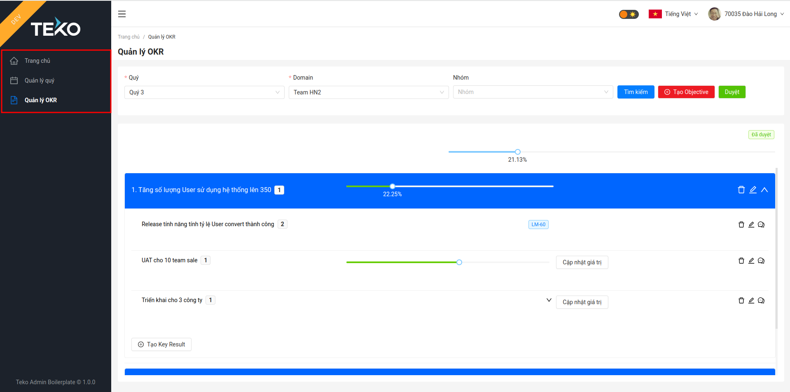
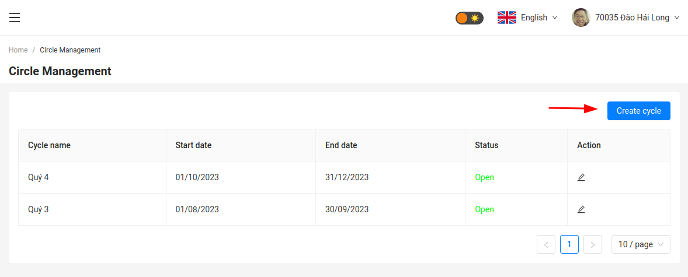
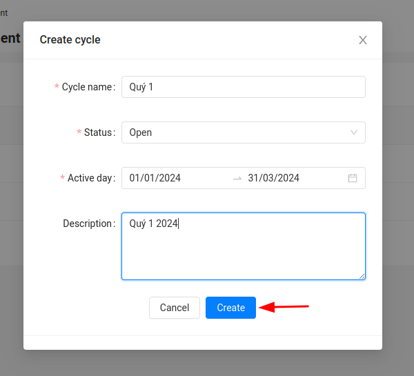

# Navigation

Includes:
- Homepage: Provide dashboard to overview about OKR process of company
- Circle Management: Manage cycle of a company
- OKR Management: Manage OKR of a company by Cycle, domain & team

# OKR-Cycles

The OKR cycles within a company can be freely defined  

Step 1: Click Create OKR

Step2: Input Data
> Active Day cannot overlap with another cycle
> 

# OKR-Planning

## Objectives

Within of the OKR Planning, the objectives and key results for a new cycle are planned in the team. New objectives can be defined and added using the button provided.  

Then the dialog for entering the objective opens:  

**Name:** Name of the objective  
**Parent Objective:** In the list you can select the business objective to which this objective contributes.  
**Description:** Supplement to the description  
**Objective is actively processed in the current cycle:** Active yes/no  

### OKR Planning – Objectives – Order

The position of an objective can be adjusted via the editing menu. This allows you to position an objective either at the beginning or at the end of the list.  

Alternatively, the objective can be moved with the mouse. To do this, grab the objective with the mouse over the left mouse button, move it and then release the mouse button.  

## Key Results

Within the OKR Planning, the objectives and key results for a new cycle are planned in the team. Key results can be added within an objective using the button provided:  

Then the following dialog for entering the key result is shown up:  

**Key Result:** Description  
**Start and target value:** Start value and target value of the key result  
**Current:** Current progress value of the key result  
**Unit:** In which unit the start, target and current value of the key result are valid (number, % or €)  
**Description:** Extended description of the key result  

### OKR Planning – Key Results - Comments

For each Key Result, comments can be entered. If comments have been entered, the number of the respective key result is displayed on the button for comments:  

If you click on the button for the comments,  a dialog opens that allows you to

1. The currently entered comments are shown.
2. A new comment can be entered

## Progress

In the overview of the objectives of a team, the progress of the individual objectives is displayed. 
The basis for this is the progress of the key results belonging to the objective. The progress is then displayed as a percentage.  

## Team members

In the overview of team members, all team members and their function in the team are displayed.  

The function of the user in the team has a direct effect on authorizations:  

**User** Across the board and in all teams  

* Change cycle for the view
* View Objectives and Key Results

**In your own team:**  

* Edit Objectives
* Edit Key Results incl. progress
* Use feedback function

**Teamadmin** In your own team  
(OKR Master / Theme sponsor)  

* Create, edit and delete objectives
* Create, edit and delete Key Results
* Assign team members to the team

**Admin**

* Create new cycle 
* Edit active and future cycles 
* Create, edit and delete structure (company) 
* Create team 
* Define OKR-Master and topic sponsor in the team 
* Delete and edit OKR project 
* Manage Admins of the application

## User settings

In the settings, the user can define individual settings. The dialog is called up via the application menu:  

The following dialog opens:  

The user can choose which client (Default Company) and which team there (Default Team) is loaded by default when the application is started.

## Adminpanel

Within the Adminpanel the Admin can assign Admin rights to other users. The dialog is called via the application menu:  

The following dialog appears:  

In this dialog, users can be assigned and revoked admin rights.

## Feedback function

Using the feedback function, feedback can be sent directly to the admin and development team of the program. The feedback function is triggered using the Feedback button:  

This opens the following dialog:  

Hierüber können Hnweise, Fragen, Fehler oder Verbesserungsvorschläge übermittelt werden.