# Navigation

Includes:
- Homepage: Provide dashboard to overview about OKR process of company
- Circle Management: Manage cycle of a company
- OKR Management: Manage OKR of a company by Cycle, domain & team

# OKR-Cycles

The **OKR cycles** within a company can be freely defined

Step 0: Click Circle Management in menu to access Circle Management
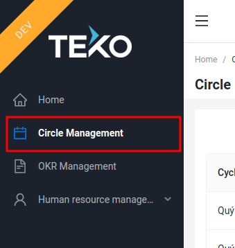

Step 1: Click Create OKR

Step2: Input Data
> Active Day cannot overlap with another cycle

| Field       | Description                                                                 |
|-------------|-----------------------------------------------------------------------------|
| Cycle name  | Name of cycle. Eg: Quý 1 2023, Teko Quý 3                                   |
| Status      | Open/Close. If cycle is close, OKR master can not update O, KR and KR-value |
| Active day  | From - To of a cycle. Cycles in same company **cannot overlap**             |
| Description | Description of a cycle                                                      |

After input data, click save and Cycle will show on Circle Management. Click button Pen if you want to
edit a cycle

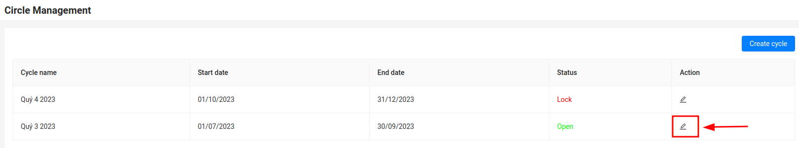

# OKR-Planning

## Objectives

Within of the OKR Planning, the objectives and key results for a new cycle are planned in the team. New objectives can be defined and added using the button provided.  

Step 0: Click Circle Management in menu to access Circle Management
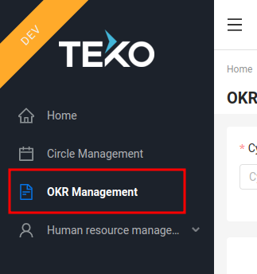

Step 1: Show list O by Domain/Team  
Select Cycle > Domain (> Team if you defined OKR follow by Team) > Click Search. List Objective of a Domain/Team 
will show below

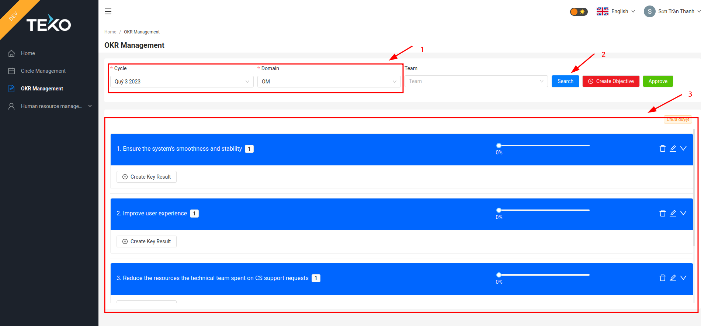

Step 2: Create a Objective
Click button Create Objective, a modal will show off

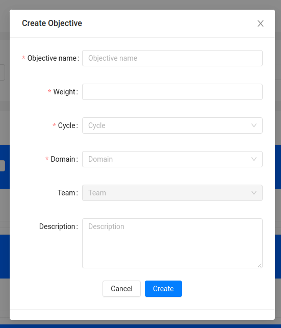

| Field          | Description                                                                                                           |
|----------------|-----------------------------------------------------------------------------------------------------------------------|
| Objective Name | Name of objective                                                                                                     |
| Weight         | The weight of the objective corresponds to the proportion of the objective within the overall goal of the Domain/Team. |
| Cycle          | Cycle of a objective                                                                                                  |
| Domain         | Domain of a objective                                                                                                 |
| Team           | Team alight with a objective if you define objective follow team                                                      |
| Description    | Desc of a objective                                                                                                   |

After input data, click save and Objective will show on OKR Management. Click button Trash/Pen/Arrow Down if you want to
delete/update or see Key Result of a Objective

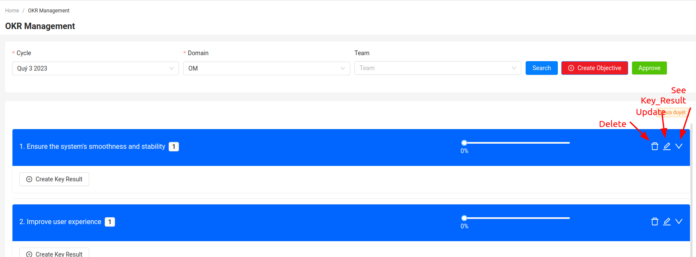

Additionally, image below is a description of some components of the Objective interface.

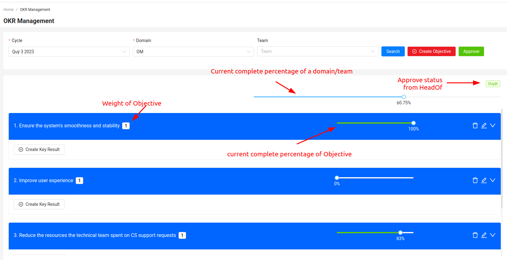

### OKR Planning – Approve

The position of an objective can be adjusted via the editing menu. But list objective of a Domain/Team need a approve from Head of Product.
So after create/update Objective/key result, complete percentage will change to 0 and OKR master need contact to HoF to confirm OKR of domain/team

Head of product login system > Select Cycle > Domain (> Team if you defined OKR follow by Team) > Click Search > Click Approve and OKR will change to approve.
Current percentage will re-calculate and show for everyone

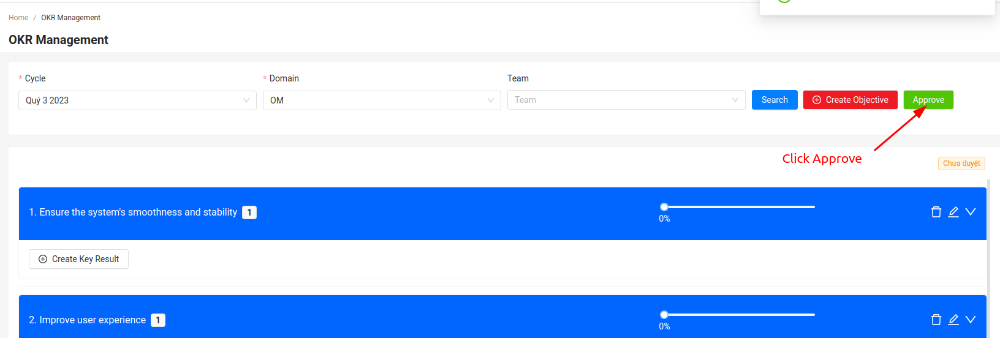

## Key Results

Step 1: Create a Key Result  
Within the OKR Planning, the objectives and key results for a new cycle are planned in the domain/team. Key results can be added within an objective using the button provided:  

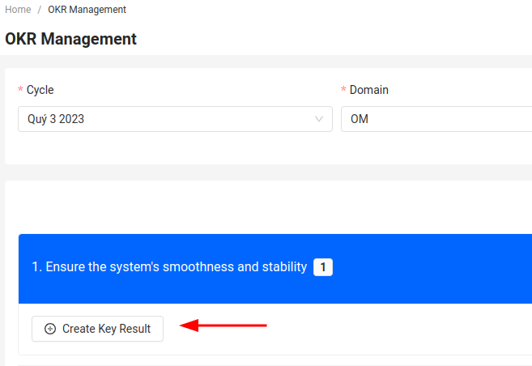

Then the following dialog for entering the key result is shown up:  

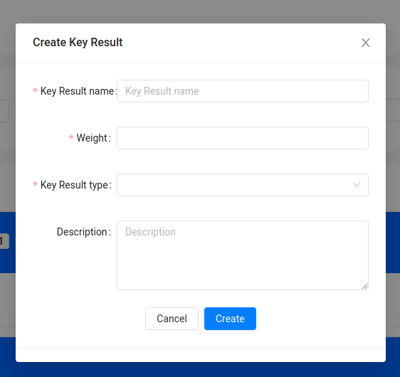

| Field                               | Description                                                                                                       |
|-------------------------------------|-------------------------------------------------------------------------------------------------------------------|
| Key Result Name                     | Name of KR                                                                                                        |
| Weight                              | The weight of the KR corresponds to objective                                                                     |
| Key Result Type                     | It includes 3 type: Link Jira/Checklist/Increase-Decrease                                                         |
| Key Result Type - Jira              | Correspond A Jira Epic, user input key of Jira (Ef: LM-1, OM-10) and system will connect to Jira teko to get data |
| Key Result Type - Checklist         | A checklist correspond with KR, after define, OKR master can update to check data                                 |
| Key Result Type - Increase-Decrease | A KR type of From - To. (EG: Target to reach 300 users to end cycle)                                              |
| Description                         | Desc of a KR                                                                                                      |

After input data, click save and KR will show on OKR Management. Click button Trash/Pen/Comment if you want to
delete/update or see Comment of a KR

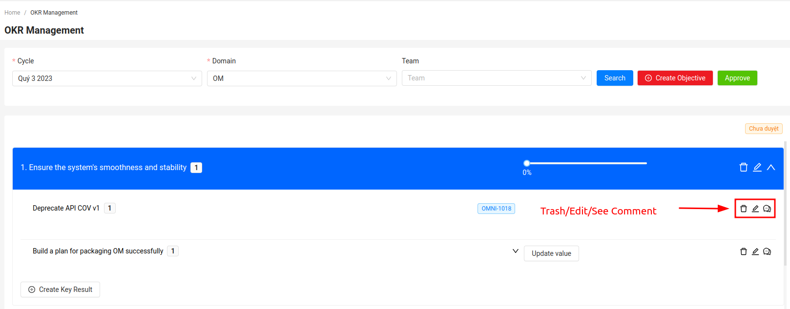

### OKR Planning – Key Results - Update KR-value

For each Key Result, comments can be entered. You must comment everytime you update value of a Key Result  

Step 1: Change value of Key Result Type: Checklist/Increase-Decrease and Click Update value. A modal comment will show of

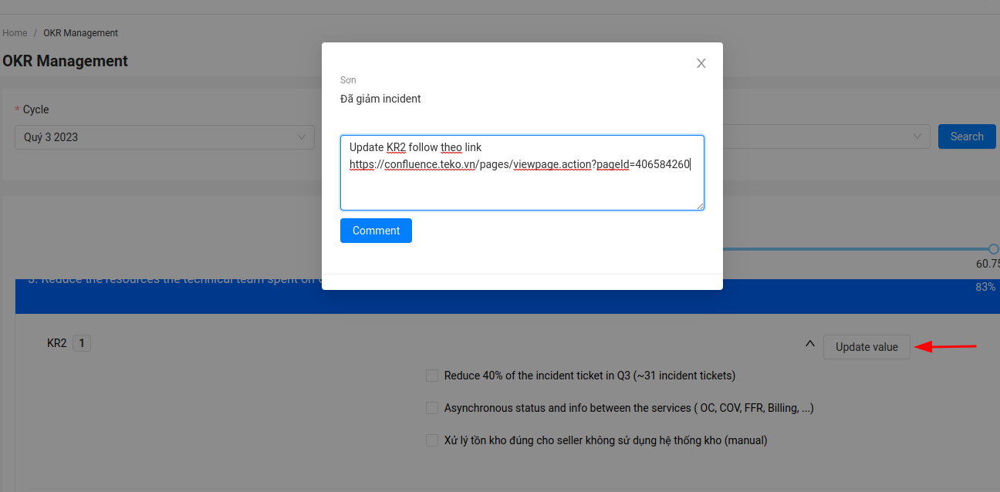

Step 2: Input comment and click Comment, KR-value will update, complete percentage will re-calculate. You can see comment of KR by click
button comment. Modal comment will show of

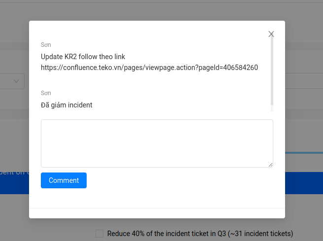

# OKR Overview
User can click to Homepage and select cycle from dropdown

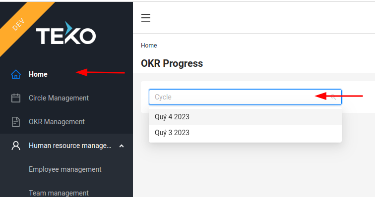

After that a diagram of complete percentage by domain of Teko will show below

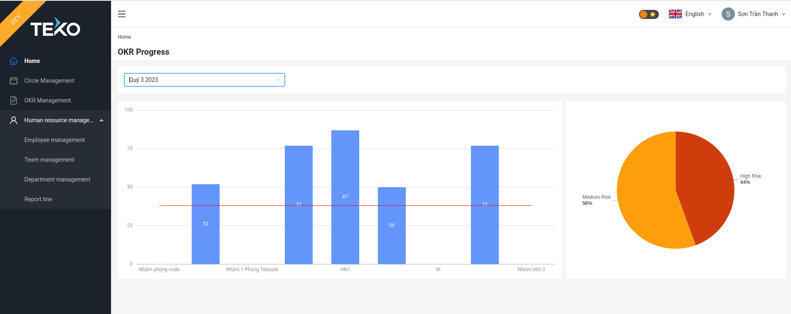

# Domain and Team

In the overview of Domain and team, system reuse Orgchart Service to manage. You can define new Domain, by:
Click Team Management > Create Team > Input Team, Description ~ Domain. OKR system will use Description of Team for Domain Name

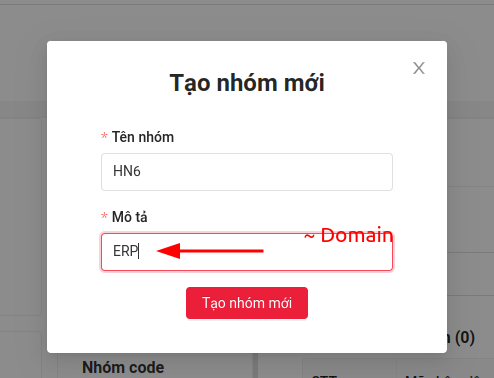

List team and list domain can see from Team Management Display of Orgchart Service

# Policy and Permission

Current system includes 4 Roles with Policy of each role follow table below

| Role            | Create/Update Cycle | Approve OKR | CRUD OKR, KR-value | See OKR |
|-----------------|---------------------|-------------|--------------------|---------|
| Admin           | x                   | x           | x                  | x       |
| Head Of Product |                     | x           |                    | x       |
| OKR master      |                     |             | x                  | x       |
| Normal          |                     |             |                    | x       |

# Feedback function

Using the feedback function, feedback can be sent directly to the admin and development team of the program.
Need Update ...

Pham Bang Huu, Duong Hong Anh, Pham Duc Thang